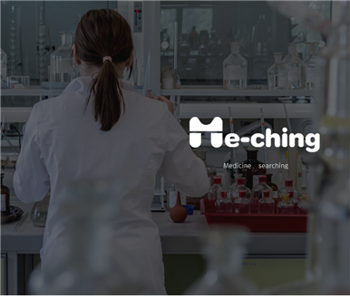
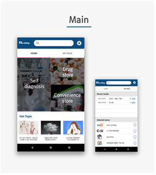

<h1 align="center">인터페이스 프로그래밍 전시회 1팀</h1>

<h2 align="center"> Me-ching</h2>

안녕하세요 프로그래밍 1팀 Me-ching입니다.
Me-ching은 Medicine searching을 뜻합니다. 
설문조사를 통해 사용자의 증상에 따라 증상완화를 돕는 약을 매칭해주는 앱입니다.

## 개발진

Team leader : 김남훈 (17지능기전)  
Front : 서인찬 (17전전통)  
Back : 오경식 (17지능기전)  
Design：이경은 (17생시공)  
mentor : 송용욱 (16컴공)  

## 개발 단계
1. 회의는 매주 금요일 동방. 하지만 거의 매일 회의함. + 카톡회의
2. 안드로이드 스튜디오 사용.
3. 전체적인 디자인 ppt활용.(가장 간단함)
4. 디자인을 기반으로 개발시작, 기술적인 부분 추가하면서 개발진행
5. 다른 기존의 앱들과 차별화를 두기위해 지속적인 브레인스토밍

## 어플설명

먼저 메인화면입니다. 
한눈에 보기 쉬운 인터페이스를 위해 탭바를 간단하게 home과 my page로만 구성하였습니다. 핫토픽은 네이버 건강탭에 있는 최신정보를 지속적으로 업데이트 해주어 쉽게 지나치는 의학정보를 바로 연동하여 볼 수 있도록 설계했습니다. 

home에서 약국과 편의점 버튼을 누르면 사용자 위치를 중심으로 가까운 곳에 운영 중인 약국 혹은 약이 구비되어있는 편의점을 쉽게 찾을 수 있습니다.

자가진단 버튼을 누를 시 뜨는 창입니다. 사용자의 증상을 쉽지만 정확하게 파악하기 위해서 부위별대로 나눈 후 그에 따른 설문을 시작합니다.

결과창입니다. 진단으로 나온 증상에 관한 질병들을 나열하고, 각 질병마다 추가 증상을 보여주며 자신의 상태와 가장 유사한 질병을 선택합니다. 대표적인 약 3가지를 추천해줍니다. 이해하기 어려운 약의 정보들을 딱 필요한 내용만 제공합니다. 만약 일반의약품으로 증상을 완화할 수 없는 질병이라면 가까운 병원을 추천해드립니다.

환경설정 부분입니다. 앱에 대한 옵션을 변경 가능하도록 구성해놓았습니다.

이상 me-ching입니다. 감사합니다
Me-ching앱은 실제로 구글 플레이스토어에서 다운 가능하며 시현해보실 수 있습니다.
